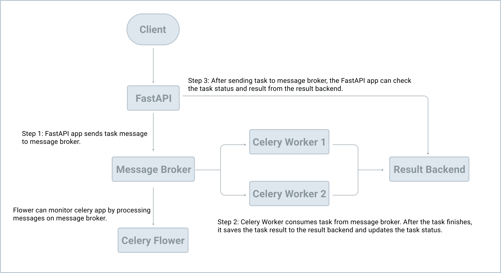

```bash
uvicorn app.main:app --reload
```

Check test Coverage

```bash
python -m pytest --cov="."
```

```bash
python -m pytest --cov="." --cov-report html
```

## Lint all files in the current dir

`ruff check`

## Formal all files in the current dir

ruff format

## Learn

- logging
- Lifecycle Events in fastapi
- monkeypatching
  - ```python

    import filename

    def test_get_custom_method(monkeypatch)
    	def mock_get_custom_method(user):
    	    return "mock value"

    	monkeypatch.setattr(filename, "custom_method", mock_get_custom_method)
    	assert len(filename.custom_method) == 20

    ```

[
    Lifespan Events - FastAPI (tiangolo.com)](https://fastapi.tiangolo.com/advanced/events/)

- works on main app, not for sub app - mounts
- Celery worker
  -------------

  


  - [The Definitive Guide to Celery and FastAPI - Getting Started | TestDriven.io](https://testdriven.io/courses/fastapi-celery/getting-started/)
- DB

  - MongoDB
  - CosmosDB: [Write a Python data layer with Azure Cosmos DB and FastAPI - Azure Cosmos DB Blog (microsoft.com)](https://devblogs.microsoft.com/cosmosdb/azure-cosmos-db-python-and-fastapi/)

    * Learn more about [Understanding your Azure Cosmos DB bill](https://learn.microsoft.com/en-us/azure/cosmos-db/understand-your-bill)
    * Learn more about [Azure Cosmos DB serverless](https://learn.microsoft.com/en-us/azure/cosmos-db/serverless)
    * Learn more about [Optimizing throughput cost](https://learn.microsoft.com/en-us/azure/cosmos-db/optimize-cost-throughput)
    * Learn more about [Optimizing storage cost](https://learn.microsoft.com/en-us/azure/cosmos-db/optimize-cost-storage)
    * Learn more about [Optimizing the cost of reads and writes](https://learn.microsoft.com/en-us/azure/cosmos-db/optimize-cost-reads-writes)
    * Learn more about [Optimizing the cost of queries](https://learn.microsoft.com/en-us/azure/cosmos-db/optimize-cost-reads-writes)
    * Learn more about [Optimizing the cost of multi-region Azure Cosmos DB accounts](https://learn.microsoft.com/en-us/azure/cosmos-db/optimize-cost-regions)
    * If you know typical request rates for your current database workload, read about [estimating request units using Azure Cosmos DB capacity planner](https://learn.microsoft.com/en-us/azure/cosmos-db/estimate-ru-with-capacity-planner)
  - SQLAlchemy
  - Testing

## Best Practises

[zhanymkanov/fastapi-best-practices: FastAPI Best Practices and Conventions we used at our startup (github.com)](https://github.com/zhanymkanov/fastapi-best-practices)

- versioning
- cache
- websocket
- webhooks
- graphql
- use session for fast
- background task
- prod: [Running FastAPI applications in production (stribny.name)](https://stribny.name/blog/fastapi-production/)
- Streaming video with fastapi [Streaming video with FastAPI (stribny.name)](https://stribny.name/blog/fastapi-video/)

Security

[CheatSheetSeries/cheatsheets at master · OWASP/CheatSheetSeries (github.com)](https://github.com/OWASP/CheatSheetSeries/tree/master/cheatsheets)

S**ecurity Vulnerability Scanners** : Along with checking for code quality and style, linters can also be used for finding security vulnerabilities. Scan your-* Code base with [Bandit](https://bandit.readthedocs.io/)

* Dependencies with [Safety](https://pyup.io/safety/)
* Docker images with [Trivy](https://github.com/aquasecurity/trivy)

## ML Modes

[shanesoh/deploy-ml-fastapi-redis-docker: Deploy and scale machine learning models with FastAPI, Redis and Docker (github.com)](https://github.com/shanesoh/deploy-ml-fastapi-redis-docker?source=post_page-----4940df614ece--------------------------------)
