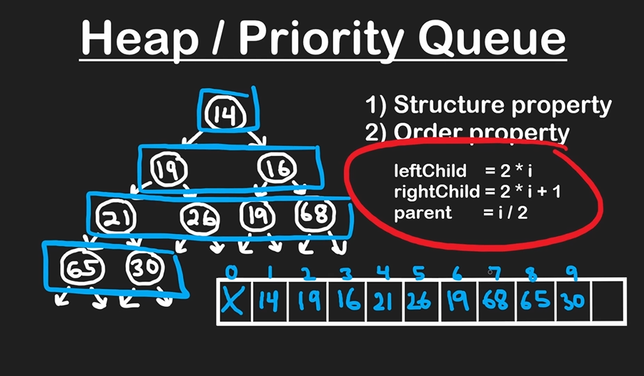
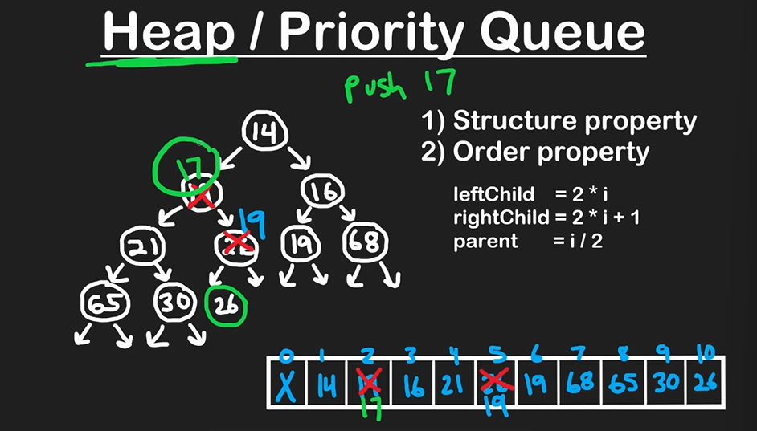
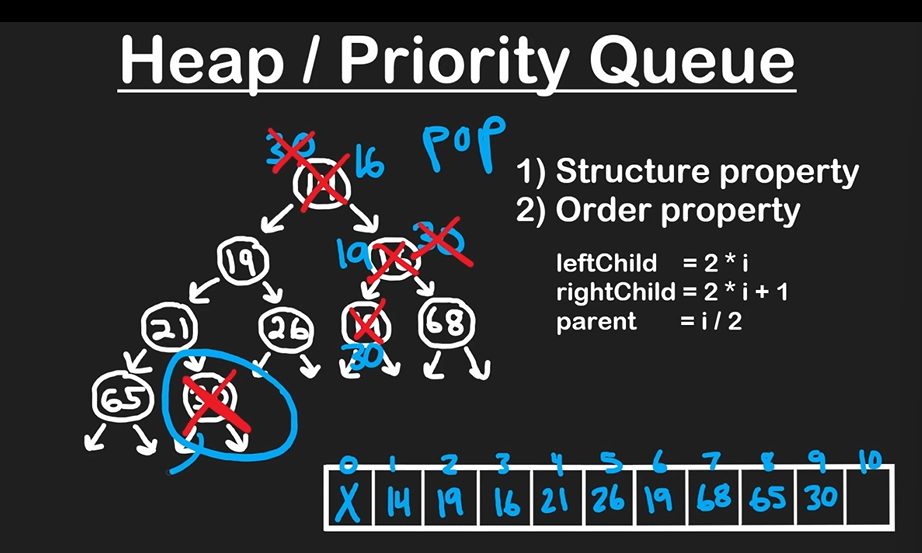

# Heap / Priority Queue

###### - priotize min or max values first

for min (min values at first)



Push  a new value (17) in max heap

Pop (first move the last value to top)

```python

 # Min Heap
class Heap:
    def __init__(self):
        self.heap = [0]

    def push(self, val): # Time Complexity Height of the tree O(logn) N is no of values in heap
        self.heap.append(val)
        i = len(self.heap) - 1

        # Percolate up
	# comparing with parent, if less than parent swap
        while i > 1 and self.heap[i] < self.heap[i // 2]:
            tmp = self.heap[i]
            self.heap[i] = self.heap[i // 2]
            self.heap[i // 2] = tmp
            i = i // 2

    def pop(self):
        if len(self.heap) == 1:
            return None
        if len(self.heap) == 2:
            return self.heap.pop()

        res = self.heap[1]   
        # Move last value to root
        self.heap[1] = self.heap.pop()
        i = 1
        # Percolate down
        while 2 * i < len(self.heap):
            if (2 * i + 1 < len(self.heap) and 
            self.heap[2 * i + 1] < self.heap[2 * i] and 
            self.heap[i] > self.heap[2 * i + 1]):
                # Swap right child
                tmp = self.heap[i]
                self.heap[i] = self.heap[2 * i + 1]
                self.heap[2 * i + 1] = tmp
                i = 2 * i + 1
            elif self.heap[i] > self.heap[2 * i]:
                # Swap left child
                tmp = self.heap[i]
                self.heap[i] = self.heap[2 * i]
                self.heap[2 * i] = tmp
                i = 2 * i
            else:
                break
        return res

    def top(self):
        if len(self.heap) > 1:
            return self.heap[1]
        return None

    def heapify(self, arr):
        # 0-th position is moved to the end
        arr.append(arr[0])

        self.heap = arr
	# you can start with half because all child nodes dont need calculation
        cur = (len(self.heap) - 1) // 2
        while cur > 0:
            # Percolate down
            i = cur
            while 2 * i < len(self.heap):
                if (2 * i + 1 < len(self.heap) and 
                self.heap[2 * i + 1] < self.heap[2 * i] and 
                self.heap[i] > self.heap[2 * i + 1]):
                    # Swap right child
                    tmp = self.heap[i]
                    self.heap[i] = self.heap[2 * i + 1]
                    self.heap[2 * i + 1] = tmp
                    i = 2 * i + 1
                elif self.heap[i] > self.heap[2 * i]:
                    # Swap left child
                    tmp = self.heap[i]
                    self.heap[i] = self.heap[2 * i]
                    self.heap[2 * i] = tmp
                    i = 2 * i
                else:
                    break
            cur -= 1
```

Top K Frequent Numbers

- Always put number
- Top K or most frequent

###### Identification

- largest/greatest, top, k,  (min heap)
- smallest/lowest, closest (max heap)

| 1 | 1 | 1 | 3 | 2 | 2 | 4 |
| - | - | - | - | - | - | - |

Map Num Frequency

| 1 | 3 |
| - | - |
| 3 | 1 |
| 2 | 2 |
| 4 | 1 |

push into heap & check heap size, pop elements above k size

###### Question

`import heapq`

* [ ] Min Heap Implementation:
* [ ] Push, pop, heapify
* [ ] Kth Smallest Element
* [ ] Kth largest element in array
* [ ] Sort a K sorted array
* [ ] K closest Numbers
* [ ] Top K frequent Numbers
* [ ] Freq Sort
* [ ] K closest points to origin
* [ ] Connect ROpes to minimise the cost
* [ ] Sum of elements between k1 smallest & k2 smallest numbers


Two Heap Questions
