## File Sharing Service

## Ref App:

1. Dropbox
2. Amazon Cloud Drive
3. Google Drive
4. Apple iCloud

## Requirements

### Functional

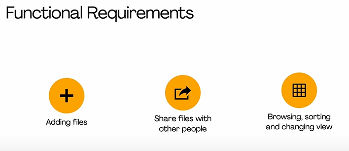

**### Non Functional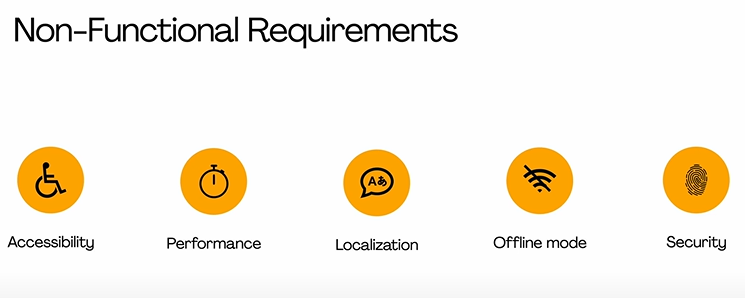**

## Archictecture

MVC

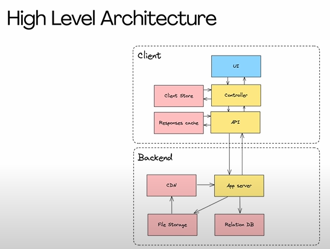

## Component Architecture

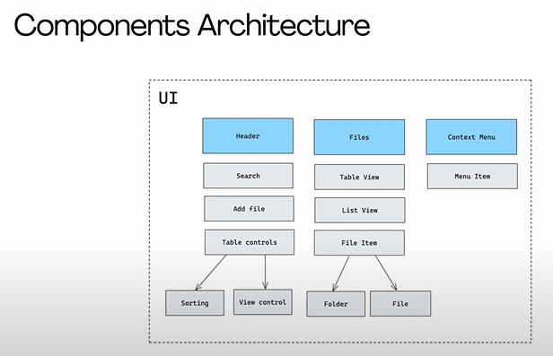

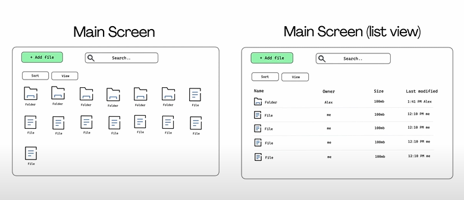

## CSR vs SSR

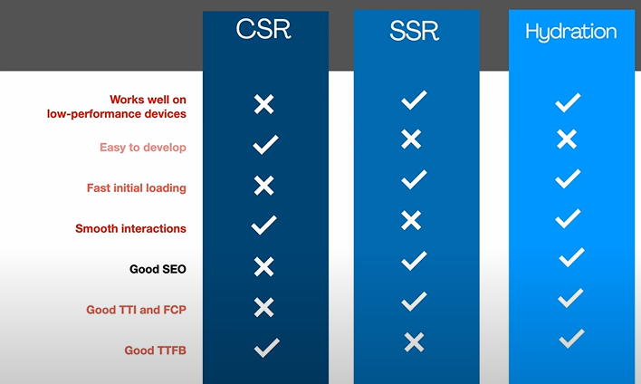

## Data Model

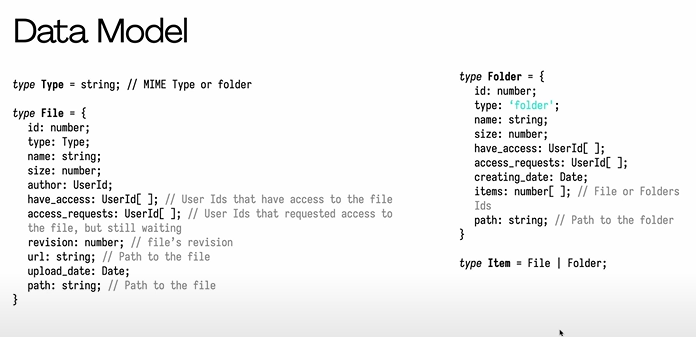

## Interesing Parts

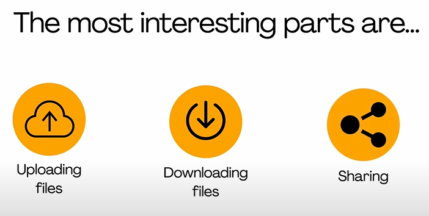

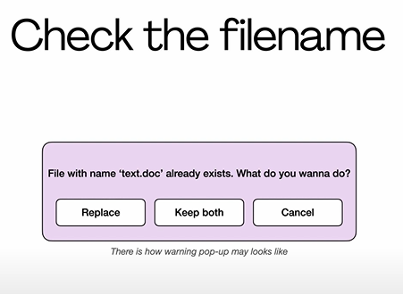

### Downloading files

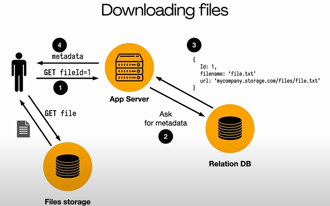

## Security

Encryption & Decryption of data

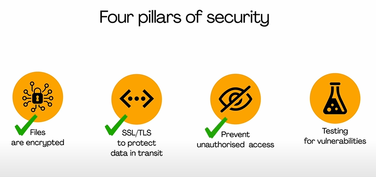

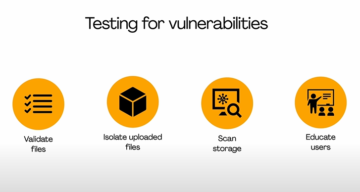

P2P connection

Synchronisation files (diff tabs, devices)

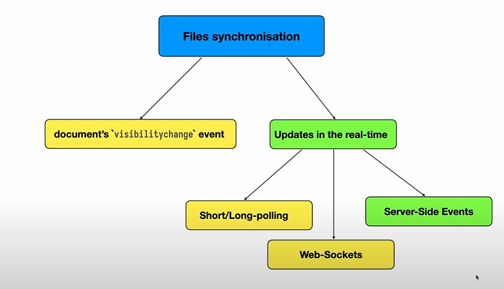

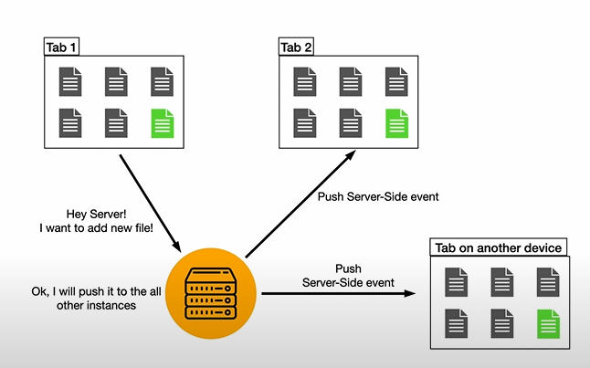

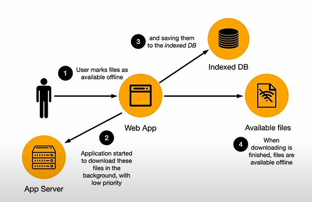

## A11y

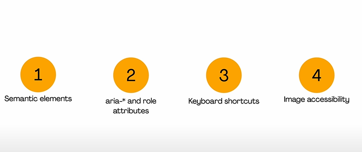

## Secrity

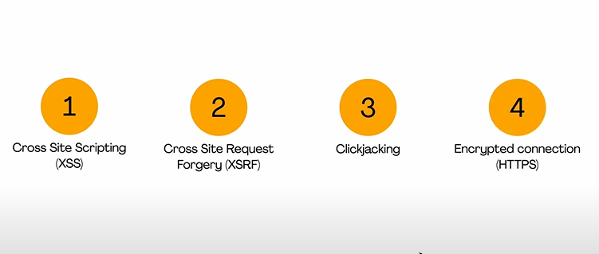
