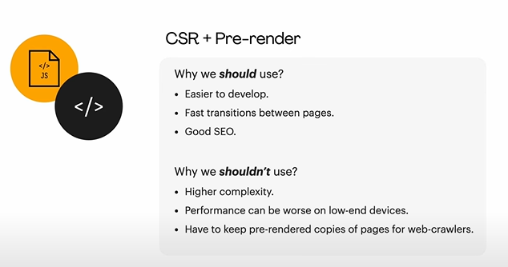
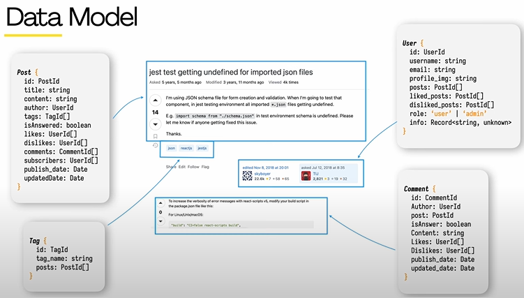
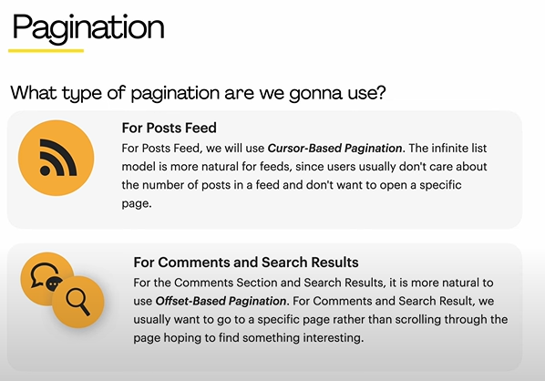
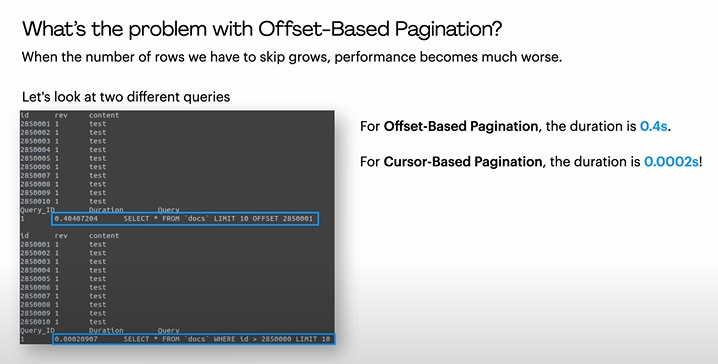
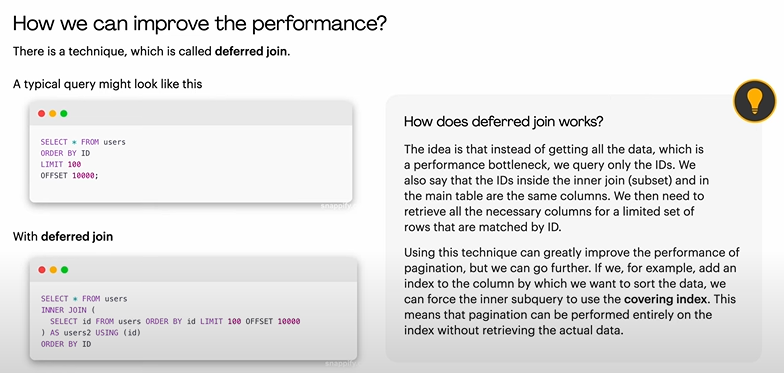
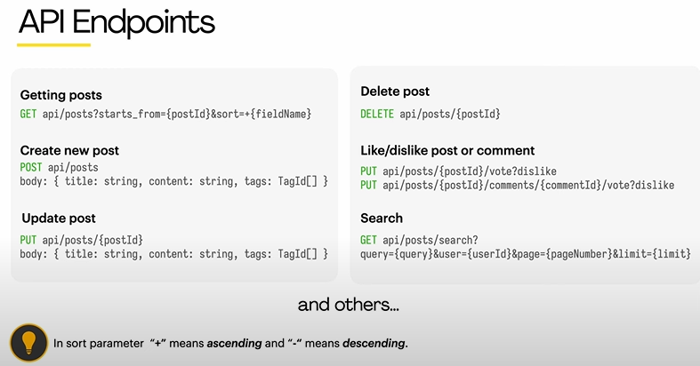
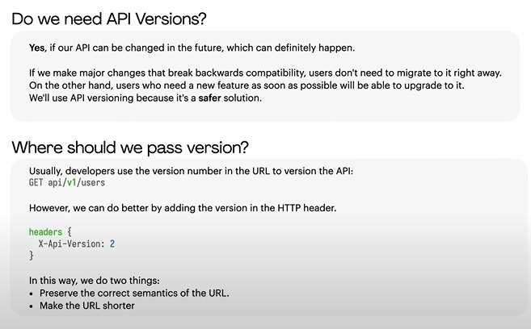

1. Quora
2. reddit
3. stackoverflow

## Features

- Feeds
- Post Creation
- Post Search
- Likes
- Subscribe to intersting post & notify
- Text Editor - support code block & images
- Latest post or most popular post

### Functional Requirement

What web app must do

- Feed
- Search
- Creating Post
- Comments
- Votes (Likes)

### Non Functional

How the app should work

- Real Time updates
- Adaption on all devices
- Performance
- A11y
- Security
- i18n

## Architecture

Real time updates - websocket

Static Files - CDN

Relational DB - as data are coupled together

## CSR os SSR

## Data Model

## Pagination

## API Endpoints

Case1: Convert K incase of too many votes

Case2: What if user tries to vote from two devices?

### API Versioning

### Text Editor

1. HTML Elemets Support
   1. contentEditable & execCommand
2. Markdown
   1. CommonMark (standardized version of markdown) ✅
3. Latex
