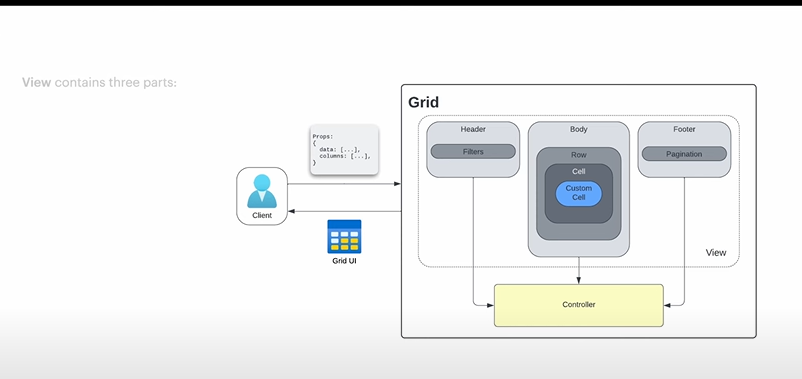
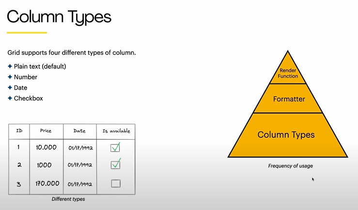

# **Table Component**

`Dmitriy Zhiganov`

**Inspirations:**

[- AG Grid Library](https://www.ag-grid.com/react-data-grid/getting-started/)

[- Design Goals Documentation](https://github.com/Microsoft/TypeScript/wiki/TypeScript-Design-Goals)

- Design of UI Component

  - Modularity & Reusablity
  - State Management within Components
- Design of Web App

  - User Centric Design
  - End to End System Architecture


## Functional Requriements

- Should colums support different types
  - Plain text by default
  - Date
  - Number
  - Checkbox
  - Dropdown
  - Custom Render
- Data Manipulation features
  - Sorting
  - Filtering
  - Pagination
  - Custom Methods
- Support Export & Import - CSV & XLS
- Do we need Server Side Rendering
- Can be used by other applications

## Non Functional Requirements

- **A11y**
  - The grid should be accessible to users with different disablites
- **Flexiblity** (Client can customise component behaviour & view)
- **Perfomance** (smooth)
- **Translation**

## Architecture



View Consist of three parts:

- Header
- Body
- Footer

`Custom Cell` is a customizable components. This means that client can pass a custom component and Grid must render it.

Controller prepares the data for presentation & handles user events.


Client is User & Developer, therefore UX & DX


## Design Goal Doument

**Goals**

- High Customizable Grid component
- A11y
- High Performance

**Non Goals**

- Support Old browser
- Adaption for mobile devices
- Offline mode support

## Internal Library vs Open Source

Distributions

- npm

  - Flexiblity
  - Offline usage
  - Web App
- CDN

  - Quick Integration
  - Benifits of CDN
  - For Websites

## Render Function vs Formatter

Redner Function is to render HTML elements. (more granular access).

Formatter: simply takes the value & converts it into something else.

```javascript
const renderFn = (value, cell, row, table) => HTML Component
const formatterFn = (value, cell, row, table) => formatted value
```





Column Resizing: Machine Coding (what is drag & Drop pattern here, how to implement it)


Virtualization

Prop Drilling Problem (useContext)

Event Delegation 


