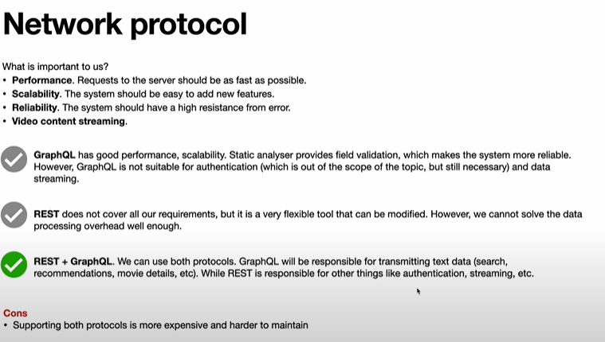

# Video Steaming Websites

Popular Websites

- HULU
- Netflix
- Amazon Prime Video
- Disney + hostar
- Youtube

Services:

- Pre recorder video streaming on demand
- Live Streaming services (news, sports, gaming stream (twitch), personal vlogs(youtube))

## Requirements

Here we are only looking for prerecorded video

Platforms - mobile, tablets, desktop

Offline feature

Search Functionality

Multilingual

### Functional Requirements

- Main page (Contains promo movie, popular movies, personal recomendation)
- Video Player
- Search Bar - Search by genres, actors, movies

### Non Functional

Perfomance

A11y

Localization

Video Protection

Offline Mode

Devices - Desktop, mobile, tablet

## UI

## High level Architecture

Frontend Contain three parts

1. UI - Main Page, Search, Player
2. Controller (User Events, Proxy layer b/w model & view, Data transformation, filteration)
3. API - Handles API Calls, errors, cache

## Render CSR or SSR or Hydration

## REST vs GraphQL

## Data Model

## How we deliver video to client (Progessive Dowloading or Streaming)

## Streaming Protocol (HLS or MPEG DASH)

## Adaptive Bitrate Streaming

## Offline Mode

### How offline mode should look like

### Enable offline with Service worker

## I18n

## A11y

## Security

