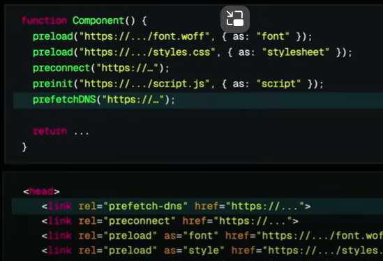

**Asynchronous transitions** 

startTransition vs useTransition: UI stays responsive while update

```js
const [name, setName] = useState("")
const [data, setdata] = useState(null)
const [isPending, startTransition] = useTransition()

function handleSubmit () {
 startTransition(async () => {
  const data = await updateData(name)
  startTransition(()=> {
   // setNonUrgentStateUpdate
   setData(data)
  })
})

return (
  <div>
    <input onChange={e => setName(e.target.value)} />
    <button onClick={handleSubmit}> {isPending ? "Updating.." : "Update"}
</button>
<span>{data?Success && "Changes saved!"}</span>
)
```


## Refactoring the above code

actions, formAction

```<form action={action}>``

```<button formAction={action}>`

Integrate Actions with forms, buttons & inputs

Functions that trigger transitions are called actions

```js
const [state, action, isPending] = useActionState(
   async(currentValue, formData) => {
    const name = await formData.get("name");
    const data = await updateData(name);
    return data;
   },
   null
)
//initalstate, return by action state

return (
	<form action={action}>
	  <input name="name"/>
        </form>
)
```

useFormStatus Hook (must e a child comp)

Get status information of the latest form submission

`const {data, pending, method, action} = useFormStatus()`


```js
function Form() {
  const [data, action] = useActionState(...)
  
  return(
   <form action={action}>
   </form>
  )
}
```


useOptimistic: update the UI before an action completes

React Server Components: 

use() api: lets you read the value of a promise or context

use ErrorBoundary & Suspense here

Server Actions: Allow Client Comp to call async func on the server -> "use server"


no need of forward ref

Preload api , prefetch-dns, preconnect, preload



