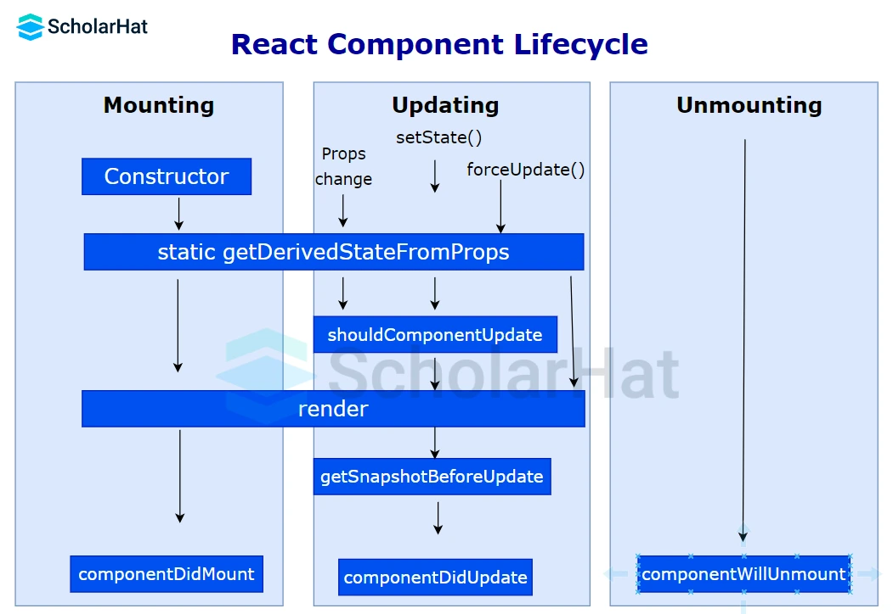

# Daily Tasks

| Date       | Task                                                                                                                                                                                                                               | Status |
| ---------- | ---------------------------------------------------------------------------------------------------------------------------------------------------------------------------------------------------------------------------------- | ------ |
| 31-08-2024 | React 1. Playlist: https://www.youtube.com/playlist?list=PLQOMi2yb4hF1u12iNcHiM1uLU4KNti6P8                                                                                                                                  |        |
|            | React Interview Questions: https://youtu.be/uE925hp9KDk?si=Kjb370GY-0NAbkvN https://www.scholarhat.com/tutorial/react/react-interview-question-and-answers https://arc.dev/talent-blog/reactjs-interview-questions/ |        |
|            | Design Pattern 1. Singleton Pattern (patterns.dev) - js 2. Singleton Pattern in python                                                                                                                                   |        |
|            | System Design https://youtu.be/GZM73-meP6c?si=5cZzGFDLfL4J227S                                                                                                                                                                     |        |
|            | TS - 5  questions                                                                                                                                                                                                                 |        |
|            | DSA - Linked list                                                                                                                                                                                                                  |        |
|            | Books Read (advance & large apps)                                                                                                                                                                                                  |        |
|            |                                                                                                                                                                                                                                    |        |

1. https://mega.nz/folder/kj9mjapY#HEV6GhTTMrDjB4wjfXz1qQ
2. What do React's synthetic events mean?
3. How do controlled and uncontrolled components in React vary from one another?
4. 

### What stages does the lifecycle of a React component go through?

**The [life cycle of a React component](https://www.scholarhat.com/tutorial/react/react-lifecycle-methods) has the following phases:**

1. Initial Phase
2. Mounting Phase
3. Updating Phase
4. Unmounting Phase

### 26. Define the lifecycle methods of React components.

**The important [React lifecycle methods](https://www.scholarhat.com/tutorial/react/react-lifecycle-methods) are:**

* getInitialState()
* componentWillMount()
* componentDidMount()
* componentWillReceiveProps()
* shouldComponentUpdate()
* componentWillUpdate()
* componentDidUpdate()
* componentWillUnmount()

## The mounting phase

Mounting is the process of adding elements to the DOM. When mounting a component, React's four built-in functions are invoked in the following order:

1. constructor()
2. getDerivedStateFromProps()
3. [render](https://www.scholarhat.com/tutorial/react/render-in-react)()
4. componentDidMount()

### 1. The constructor method

* The constructor() method is the most obvious option to set up the initial [state](https://www.scholarhat.com/tutorial/react/exploring-the-power-of-state-in-react) and other initial settings because it is called first when the component is launched.
* The super(props) function should always be performed first since it will start the parent's constructor method and enable the component to inherit methods from its parent (React.Component).
* The constructor() method is called with the props as arguments

### 2. The static getDerivedStateFromProps method

* Before [rendering](https://www.scholarhat.com/tutorial/react/conditional-rendering-in-react-creating-dynamic-user-interfaces) the DOM element(s), the getDerivedStateFromProps() function is used.
* Based on the initial [props](https://www.scholarhat.com/tutorial/react/a-guide-to-passing-props-in-react), this is the logical place to set the state object.
* It accepts the parameter state and returns an object containing the state's modifications.

### 3. The render method

* The method that actually outputs the HTML to the DOM, render(), is necessary.
* https://www.scholarhat.com/tutorial/react/render-in-react

### 4. The componentDidMount method

* After the component is rendered, the componentDidMount() function is invoked.
* You execute instructions that need the component to be in the DOM at this point.

## The updating phase

When a component is updated, the lifecycle moves on to the next step.Every time a component's state or props change, the component is updated.When a component is changed, React's five built-in methods are called in the following order:

1. The static getDerivedStateFromProps
2. The shouldComponentUpdate method
3. The getSnapshotBeforeUpdate method
4. The componentDidUpdate Method

### 1. The static getDerivedStateFromProps

* getDerivedStateFromProps is the first lifecycle method to be invoked during the update phase.
* If you have updated props and want the component's state to reflect that, this technique can be helpful.
* For instance, the value of a component's props could affect how it behaves.
* Before the component was ever re-rendered, its state might already reflect the changes and be displayed (if appropriate) to the just-changedcomponent using getDerivedStateFromProps.

### The shouldComponentUpdate method

* Another lifecycle method that is hardly used is shouldComponentUpdate.
* It basically enables you toinform React when you don't need to re-render when a new state or props comes in, and it's designed primarily for performance optimization.
* Although it can assist in avoiding re-renders, you shouldn't rely on it to do so because you risk losing an essential change and running into issues.
* Although nextProps and nextState are available as arguments for this function, you can also define it without them.
* A Boolean value is then returned by this procedure.
* A re-render is determined by the Boolean value.
* Re-rendering takes place in all circumstances whenever thestate or props change when the default value is true.

### The getSnapshotBeforeUpdate method

* You can obtain the component's prior props and state before it is updated by using the getSnapshotBeforeUpdate function.
* This enables you to alter or examine the state's or the props' earlier values.
* Another infrequently employed technique is this one.
* Managing scroll positions in a conversation app is a nice application for this technique.
* It shouldn't force the older messages out of view when a new message arrives while the user is still seeing older messages.
* After calling the render function, getSnapshotBeforeUpdate is called before componentDidUpdate.
* If the getSnapshotBeforeUpdate method returns anything, the componentDidUpdate method will get it as a parameter.

### The componentDidUpdate Method

* The final lifecycle method used during the update phase is the componentDidUpdate method.
* By using it, you can produce unintended consequences like launching network requests or invoking this.setState method.
* It's critical to keep in mind that if the setState isn't always possible to avoid (via logic, for example), rendering will continue indefinitely.
* If the getSnapshotBeforeUpdate method is used, this function can accept up to three parameters: prevProps, prevState, and snapshot.

## The unmounting phase

The third and last phase of a React component is unmounting. The component is now eliminated from the DOM. There is only one lifecycle method involved in unmounting:

1. The componentWillUnmount Method

### The componentWillUnmount Method

* Just before the component is unmounted or deleted from the DOM, componentWillUnmount is called.
* It is intended for any necessary cleanup of the component, such as canceling network requests or unsubscribing from any subscriptions (such as Redux).
* The component will be destroyed after this method has completed its operation.

### 29. How does React's HOC work?

HOC can be used for a wide range of tasks, some of which are listed below:

* Code Reusability
* Props manipulation
* State manipulation
* Render highjacking

### What distinguishes a React component from an element?

Elements and [components in react ](https://www.scholarhat.com/tutorial/react/react-js-components)differ mostly in the following ways:

| **SN** | **Element**                                                                                                        | **Component**                                                                                                                                         |
| ------------ | ------------------------------------------------------------------------------------------------------------------------ | ----------------------------------------------------------------------------------------------------------------------------------------------------------- |
| 1.           | An element is a simple JavaScript object that specifies the desired characteristics of the DOM node and component state. | The fundamental building block of a React application is a component. This class or function takes an input and outputs a React element in return.          |
| 2.           | It simply contains data about the kind of component, its attributes, and any child components that are contained within. | It has access to the[React lifecycle functions](https://www.scholarhat.com/tutorial/react/react-lifecycle-methods) and is capable of holding states and props. |
| 3.           | It is unchangeable.                                                                                                      | It is changeable.                                                                                                                                           |
| 4.           | On elements, we are unable to use any methods.                                                                           | We are able to use techniques on parts.                                                                                                                     |

### Why do fragments work better in React than container divs?

* Because fragments do not generate additional DOM nodes, they operate more quickly and use less memory.
* Maintaining the intended layout might be challenging with certain CSS styling, such as CSS Grid and Flexbox, which introduce `
` tags in the middle and have unique parent-child relationships.
* There is less clutter in the DOM Inspector.

### How can I use [React validation on props](https://www.scholarhat.com/tutorial/react/a-guide-to-passing-props-in-react)?

* Props validation is a tool that aids developers in preventing faults and issues in the future.
* It improves the readability of your code.
* PropTypes is a unique property used by React components that helps you find errors by verifying the data types of values supplied through props.
* You do not have to define components with propTypes in order to use them.
* We may use App.propTypes in the [React component](https://www.scholarhat.com/tutorial/react/react-js-components) to apply validation on props.
* The JavaScript console will display warnings if any properties are supplied with an invalid type.
* You must set the App.defaultProps after defining the validation rules.

### Which guidelines should you adhere to when using React's hooks?

When using Hooks in your code, you have to abide by two rules:

1. [React Hooks](https://www.scholarhat.com/tutorial/react/hooks-in-react) can only be invoked at the highest level. Calling them from within loops, conditions, or nested functions is prohibited.
2. Calling the Hooks is only permitted from React Function Components.

### What are React's Forward Refs and when are they used?

* One feature that is utilized to send a reference from one component to one of its child components is called ref forwarding.
* The React.forwardRef() function can be used to carry it out.
* It works very well with [higher-order components](https://www.scholarhat.com/tutorial/react/redux-in-react) and is utilized specifically in libraries of reusable components.

### In React, which is the better choice—callback references or findDOMNode()?

* Callback references are a better solution than the findDOMNode() API.
* Because findDOMNode() precludes some future enhancements in React, and callback refs provide better control when the refs are set and unset

### Describe the concept of flux.

The unidirectional data flow is enforced by the architectural pattern known as flux. Utilizing a central store with authority over all data, it facilitates communication between various components and manages generated data. Any updates to the data across the application must happen exclusively here. Flux lowers run-time errors and gives the program stability.

### What three key principles does Redux adhere to?

* **One and only source of truth:** An object/state tree inside a single store contains the state of the entire application. It is simpler to debug or inspect the program and to keep track of changes over time using a single state tree.
* **Read-only status:** An action must be triggered in order to alter the state. A simple JS object that describes the change is called an action. The action is the minimal representation of a change to the data, the same as the state is the minimal representation of data.
* **Modifications are made using pure functions:** Pure functions are required to define the actions' transformation of the state tree. Functions classified as pure have a return value that is exclusively determined by the values of their inputs.
* 

### 51. What is the difference between useEffect and componentDidMount?

The useEffect is a hook that runs after the render cycle is complete. useEffect can be used to manage side effects in functional components. While componentDidMount is a lifecycle method that runs after the initial render in class components. The useEffect can be configured to run on every render, only on the initial render, or when specific dependencies change.

### What is React.memo and when would you use it?

* React.memo is a higher-order component that prevents a functional component from re-rendering if its props haven't changed.
* It is used for performance optimization by memoizing the component and is useful when you have a component that renders the same output given the same props

### Explain the difference between useRef and createRef.

* useRef is a hook that returns a mutable ref object whose .current property is initialized to the passed argument.
* It persists between renders and can be used to store a reference to a DOM element or any mutable value. createRef is a method used in class components to create a ref.
* It returns a new ref object that can be attached to a DOM element via the ref attribute.
* useRef is typically used in functional components, while createRef is used in class components.

Frontend Web Security: https://www.youtube.com/playlist?list=PLQOMi2yb4hF0kyhFOcgDWvWkonMDLquqy

Redux Best Practises: https://www.youtube.com/playlist?list=PLQOMi2yb4hF3jxl5dD2IDd6pzeqaarD4s

Cool Tech

1. matter.js
2. react native
3. nextjs
4. prisma
5. 

10 - 12 -> Accordion (10min) , Progressbar (30min), C Shape (1hr) | 1hr 40min
12 - 2 -> Design pattern (singleton, proxy)
2  - 4 -> SDK
            1. Alex Trost with Chris Ferdinandi
            2. Alex Trost with Stephanie Eckles
            3. Generative team section
            4. Reinventing the signup form

5. Matt Pocock: The NPM library speed run 90 mins to build CI & library
   4  - 6 -> Revise

---

1. System Design
2. Machine Coding
3. Accessiblity
4. JS Revise
5. Polyfills

---

6. ReactJS Machine Coding & Deep Dive
7. DSA
8. Topmate interview schedule

Resources
website

- javascript.info
- bigfrontend.dev
- frontendeval
- leetcode

Youtube Channels

- xplodivity
- roadsidecoder
- jscafe
- uncommongeeks
- mike chen
- techrally
- jser
- tejas kumar
- code with Ania Kubow (JS games)
- alex trost (sdk)

Vijay Bhati

1. Star Rating
2. Carousel
3. Nested Comments
4. Todo list
5. Tic Tac Toe

Xplodivity

- 1. Custom Date Picker
- 2. C Shape (Make my trip question)
- 3. Toast Notification
- 4. Progressbar
- 5. Pixel Art Maker
- 6. Stack & Queue (UI)
- 7. Tic Tac Toe
- 8. Star Rating
- 9. Drag & Drop
- 10. snapshot/ preview on video slider
- 11. Timer CountDown
- 12. Typewritter Effect
- 13. Nested Comments (React)
- 14. Accordion

4 days (5 question each day)
14 Thus |  15 Fri |  16 Sat | 17 Sun

Design Patterns in JS

1. Singleton (xplodivity)
2. Proxy Patern (xplodivity)
